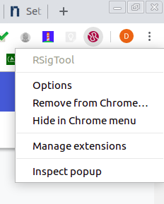
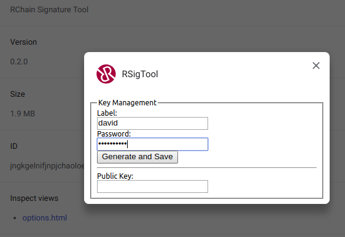
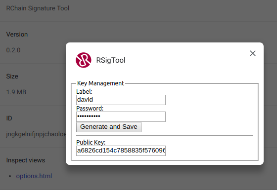
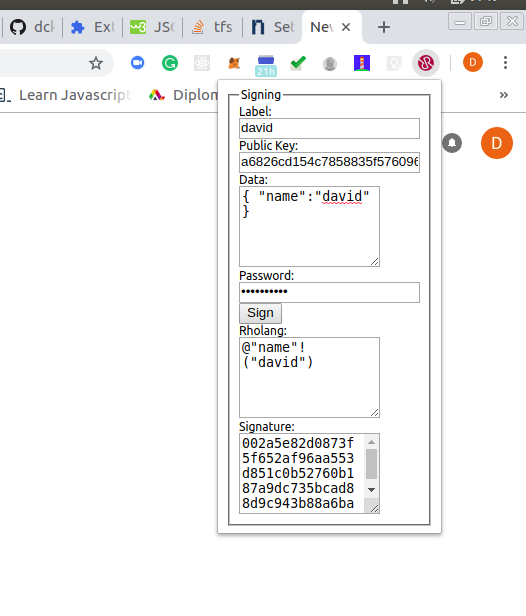
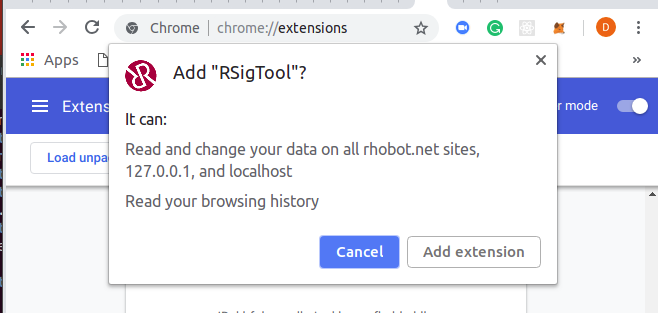

# RSign - RChain Signature Tool (Alpha)

by Dan Connolly

copyright (c) RChain Cooperative 2018.
Share and Enjoy under the terms of the Apache Software License.

## Usage: Key Management, Signing

Provided it's installed as below:

### Create a key pair

1. Right click to bring up options

2. Provide label and password

3. click Generate...

### Sign some data

  1. Pop-up the extension
  2. Put JSON in the data field
  3. Enter password
  4. Press Sign

### Communiation with dApps

dApps can subscribe to pop-notices, provide JSON data, and receive
signatures. For example, see
[Rchain-Status](https://github.com/dckc/Rchain-Status/tree/sig-ext).

## Installation as Chrome Extension

Only Chrome (and Chromium) are supported to date. Firefox support is
planned.

 1. Open the `chrome://extensions`.
 2. Ensure **Developer mode** is checked.

Download the latest `.crx` file from https://github.com/dckc/RSign/releases
and drag it onto the extensions page.

